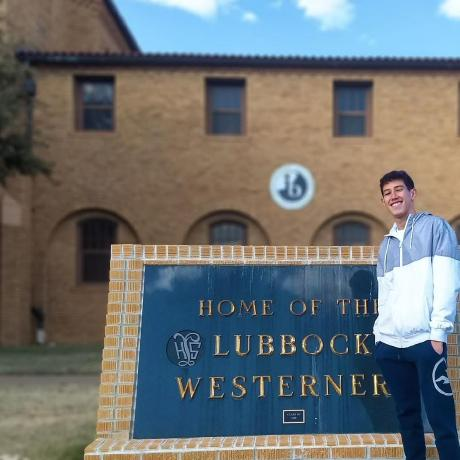

[](https://github.com/felipehonorato1)
[](https://github.com/GuilhermeJC13) 
[](https://github.com/DougsterS) 
[](https://github.com/luizfsoares) 
[](https://github.com/romulokps)
[](https://github.com/voczie) 

[](https://www.python.org/downloads/release/python-365/)

# StorIA
This project is focused on the collaborative writing between the user and our AI. We have used [huggingface](huggingface.co/) package to train our Distil-GPT2 model. There's also a notebook explaining the steps we've used to train it.

The data used was scrapped of subreddits such as [nosleep](https://www.reddit.com/r/nosleep/), [shortscarystories](https://www.reddit.com/r/shortscarystories/). 

Check out our [project](https://storia-taill.herokuapp.com/).

---

## Table of Contents
- [StorIA](#StorIA)
  - [Table of Contents](#table-of-contents)
  - [Assignments](#assignments)
  - [Clone](#clone)
  - [Authors](#authors)
  

---
## Assignments

### **CONSTRUÇÃO DO DATASET**

Para treinar o modelo, será necessário baixar uma boa quantidade os posts da sub desejada do Reddit. Precisamos dos posts e da popularidade de cada post.  A API do próprio Reddit já permite isso. Para utilizá-la é necessário criar uma conta e solicitar acesso a [API](https://www.reddit.com/dev/api/). Depois de criada a conta, utilizamos a biblioteca [PRAW](https://praw.readthedocs.io/en/stable/) e entramos com os dados de autenticação da gerados na etapa anterior. A API deve retornar os posts que irão compor o dataframe que será utilizado para treinar o modelo. Etretanto existe uma limitação para 1000 posts. Temos duas opções: podemos pegar os 1000 mais populares ou podemos pegar os 1000 mais recentes. Outra opção que a API fornece é retornar o post referente a algum id específico.  Uma das ideias para conseguir baixar mais do que essa limitação foi usar a função random da API, que retorna um post aleatório. Depois disso, repetiríamos a função random X vezes até conseguir uma quantidade

### **PRÉ-PROCESSAMENTO** <!-- Victória -->

O pré-processamento feito consiste em buscar remover imperfeições dos textos do nosso dataset, algo que é bastante comum em dados que não são totalmente controlados como os obtidos em fóruns e redes sociais. Essa etapa é de fundamental importância pois o texto visto servirá de "molde" para os textos que serão gerados pela máquina.

#### **1. Remover linhas que estivessem com o corpo do texto deletado ou duplicado.**
Dentro do dataset foi possível encontrar uma boa quantidade de linhas duplicadas ou com o atributo do corpo de texto descritos como "deleted" ou "removed". Optamos por deletar a linha inteira caso detectássemos algum destes casos.
#### **2. Substituir, através de expressões regulares, pedaços de texto que atrapalhariam no treinamento.**
Muitos dos textos possuíam links, que retiramos, e cadeias de caracteres que fazem parte da sintaxe do Markdown. Como a intenção é que o modelo gerasse textos para serem lidos em HTML, foi necessário substituir as partes em Markdown, principalmente as quebras de linha.
#### **3. Adicionar tokens de marcação.**
Inserimos dentro dos textos os tokens de início de texto ```<|startoftext|>``` e de fim de texto ```<|endoftext|>```. Além disso, adicionamos a marcação de quebra de linha em HTML, o ```<br>```, como token para o nosso modelo.
#### **4. Dividir o dataset em dois.**
Separamos nossos dados tratados em duas váriaveis, o dataset de treinamento, que fica com 80% dos textos, e o dataset de teste, que fica com os outros 20%.
#### **5. Criar o tokenizer e o dividí-lo em batches.**

Executadas as etapas supracitadas, prosseguimos com o treinamento do modelo. 

### **ABORDAGEM**

Optamos pela utilização do modelo transformer para o treinamento da nossa rede neural. Essa escolha se deu pelo fato da mesma ser o atual estado da arte para modelos de linguagem focados na geração textual, superando até modelos clássicos como os RNNs padrões, GRUs e até as LSTM, que por muito tempo foram os modelos mais utilizados para esse tipo de trabalho, mas que sofriam de problemas ligados à otimização, visto que as células utilizadas não processam simultaneamente uma sequência de palavras, e sim sequencialmente palavra por palavra, o que aumentava consideravelmente o tempo de treinamento. Além disso, os transformers possuem uma maneira mais eficiente de recorrer às informações passadas. Enquanto as LSTMs e as GRUs utilizam das células de mémoria para se basear nas próximas gerações, os transformers têm acesso direto ao contexto, sem utilizar dessas células citadas anteriormente.


Nossa metodologia consistiu em utilizar o modelo pré-treinado distilgpt2, do huggingface, e então fazer o ajuste fino dos parâmetros utilizando uma grande base de dados contendo mais de 100.000 histórias de terror. O modelo distilgpt2 foi escolhido por ser a menor versão do GPT2, possuindo menos parâmetros e consequentemente sendo mais rápida e menos custosa para treinar, visto que para o treinamento foi utilizada uma única GPU disponibilizada através do Collab.

O nosso modelo foi treinado por cinco épocas, com oito batches, levando aproximadamente 12 horas e 53.705 passos de otimização. A base de dados possuia 107.402 textos onde 85.921 foram usados no treino e 21.481 foram usados na validação.

### **Deploy e conclusão**

Após o treinamento do modelo, foi gerado todos os checkpoints para recriá-lo e construído toda a interface, incluindo os templates e rotas de consumo. Para isso, foi utilizado o Flask, que é um microframework web escrito em Python, para a construção das rotas e HTML, CSS e Bootstrap -outro framework web de código aberto- para a construção dos templates renderizados pelas rotas do Flask. Algo importante a se comentar é que, como os checkpoints do modelo são bem pesados, ou seja, ultrapassam os limites de tamanho de arquivo do git (100mb). Dessa forma, o consumo do modelo foi realizado via API de compartilhamento do Hugging Face e não precisou fazer a persistência do modelo para o disco. Assim, os dados (texto, temperatura e tamanho) são enviados pelo formulário e recebidos pelo Flask, onde ocorre um pequeno pré-processamento, apenas para adequar o formato de entrada. Após isso, os dados de entrada são enviados na requisição para o modelo como parâmetros e o texto gerado é retornado.

Após ter a interface finalizada e funcional localmente, foi realizado o deploy da aplicação via [Heroku](https://www.heroku.com/home). Os passos são bem simples, sendo necessário apenas criar uma conta, conectar com a do Github e escolher um repositório com o formato adequado, ou seja, com o arquivo requirements.txt com as bibliotecas que devem ser instaladas e o arquivo Procfile que tem o comando de inicialização da aplicação, que nesse caso foi ```web: gunicorn app:app```. Lembrando que o código e toda essa estrutura pode ser visualizado em nosso [repositório](https://github.com/TailUFPB/storIA) no Github.

Para avaliação do modelo, utilizamos a perplexidade, que é uma métrica que avalia, de acordo com nossa fatia de dados separadas para validação, quão bem o modelo consegue predizer a próxima palavra de uma história. Ou seja, compara o texto gerado palavra a palavra pelo modelo com uma parte dos textos do dataset. A perplexidade atingiu o valor de  22.194 na etapa final do treinamento.

---

## Clone

- Clone this repo to your local machine using
    > https://github.com/TailUFPB/storIA.git

---
## Authors

| <a href="https://www.linkedin.com/in/luizfcardoso/" target="_blank">**Luiz Felipe**</a> | <a href="https://www.linkedin.com/in//" target="_blank">**Maria Victória Grisi**</a> | <a href="https://www.linkedin.com/in/guilhermejacome/" target="_blank">**Guilherme Jacome**</a> | <a href="https://www.linkedin.com/in/douglas-monteiro26/" target="_blank">**Rômulo Kunrath**</a> | <a href="https://www.linkedin.com/in/felipehonoratodesousa/" target="_blank">**Felipe Honorato**</a> | <a href="https://www.linkedin.com/in//" target="_blank">**Douglas Monteiro**</a> |
|:---------------------------------------------------------------------------------------:|:------------------------------------------------------------------------------------:|:-----------------------------------------------------------------------------------------------:|:------------------------------------------------------------------------------------------------:|-----------------------------------------------------------------------------------------------------:|:--------------------------------------------------------------------------------:|
|  </img> |  </img> |  </img> |  </img>  |  </img> |  </img> |
| <a href="http://github.com/luizfsoares" target="_blank">`github.com/luizfsoares`</a> | <a href="https://github.com/voczie" target="_blank">`github.com/voczie`</a> | <a href="http://github.com/GuilhermeJC13" target="_blank">`github.com/GuilhermeJC13`</a> | <a href="https://github.com/romulokps" target="_blank">`github.com/romulokps`</a> | <a href="https://github.com/Felipehonorato1" target="_blank">`github.com/Felipehonorato1`</a> | <a href="https://github.com/DougsterS" target="_blank">`github.com/DougsterS`</a> |
