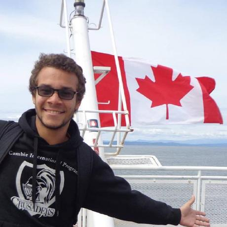

 
 
  

https://github.com/DougsterS

# StorIA
This project is focused on the collaborative writing between the user and our AI. We have used [huggingface](huggingface.co/) package to train our Distil-GPT2 model. There's also a notebook explaining the steps we've used to train it.

The data used was scrapped of subreddits such as [nosleep](https://www.reddit.com/r/nosleep/), [shortscarystories](https://www.reddit.com/r/shortscarystories/). 

---

## Table of Contents
- [StorIA](#StorIA)
  - [Table of Contents](#table-of-contents)
  - [Interface](#interface)
  - [Assignments](#assignments)
  - [Clone](#clone)
  - [Authors](#authors)
  

---
## Assignments

---

## Clone

- Clone this repo to your local machine using
    > https://github.com/TailUFPB/storIA.git

---
## Authors

|<a href="https://www.linkedin.com/in/luizfcardoso/" target="_blank">**Luiz Felipe**</a> | |<a href="https://www.linkedin.com/in//" target="_blank">**Maria Victória Grisi**</a> | <a href="https://www.linkedin.com/in/guilhermejacome/" target="_blank">**Guilherme Jacome**</a>      |<a href="https://www.linkedin.com/in/douglas-monteiro26/" target="_blank">**Rômulo Kunrath**</a> | <a href="https://www.linkedin.com/in/felipehonoratodesousa/" target="_blank">**Felipe Honorato**</a>      |
|:-----------------------------------------------------------------------------------------:|:---------------------------------------------------------------------------------------:|:-----------------------------------------------------------------------------------------:|:---------------------------------------------------------------------------------------:| 
|                    </img>                            |                </img>                          |                    </img>                            |                </img>                          |
|               <a href="http://github.com/DougsterS" target="_blank">`github.com/DougsterS</a>      |  <a href="https://github.com/GuilhermeJC13" target="_blank">`github.com/GuilhermeJC13`</a>  |               <a href="http://github.com/luizfsoares" target="_blank">`github.com/luizfsoares`</a>      |  <a href="https://github.com/Felipehonorato1" target="_blank">`github.com/Felipehonorato1`</a>  |  <a href="https://github.com/Felipehonorato1" target="_blank">`github.com/f`</a>  |
